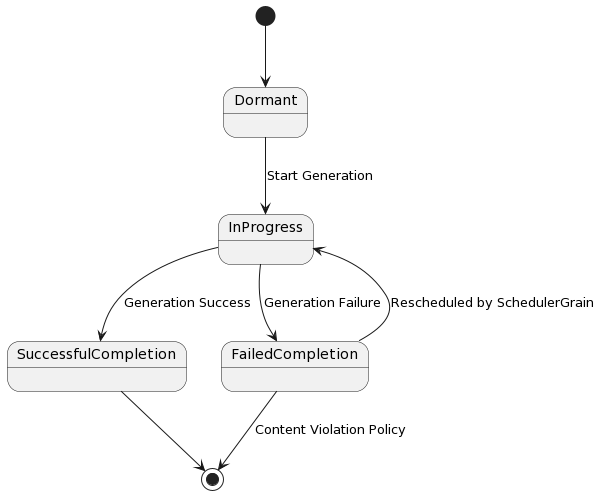

Image generator use Orleans framework to manage generation via openAI/Dalle
Image Generator is driven by 3 Grains called:
1. MultiImageGeneratorGrain
2. ImageGeneratorGrain
3. SchedulerGrain

Here MultiGeneratorGrain has a function which is an entryPoint and receives the arguments:
- traits
- numberOfImages
- multiImageRequestId

** generation is asynchronous

## ImageGenerationState is mantained in in-memory state of MultiImageGeneratorGrain

### ImageGenerationState

```cs
RequestId : string
Traits  : string[]
Prompt : string
IsSuccessful : Boolean
Errors : string[]
ImageRequestIds: string[]
imageGenerationTrackers : Dictionary<String, ImageGenerationTracker>
```

### ImageGenerationTracker:


```cs
RequestId : string
status: ImageGenerationStatus
Error: string
```


ImageGenerationTracker is to track the each generation associated with parent/MultiImageGenerator

#### ImageGenerationStatus takes valid values:
1. Dormant
2. InProgress
3. FailedCompletion
4. SuccessfulCompletion

- Status starts at `Dormant` and then it will progressively transit to `InProgress` followed by `SuccessfulCompletion` or `FailedCompletion`
- An ImageGenerationGrain can revert back to `InProgress` from `FailedCompletion` as it can be rscheduled for regeneration by SchedulerGrain
- Another possible transition where FailedCompletion could be due to a COntent Violation Policy so in such case the Status can end up in FailedCompletion

